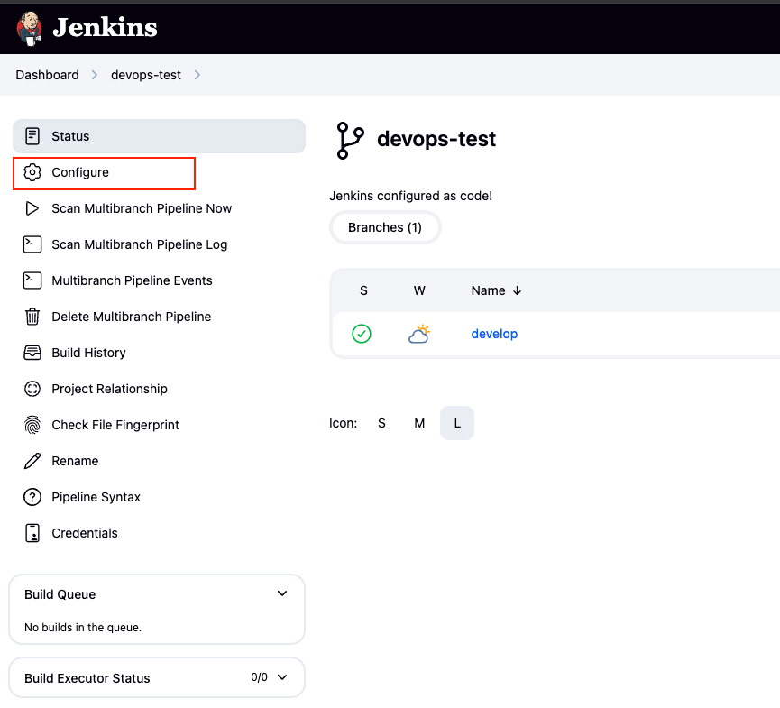
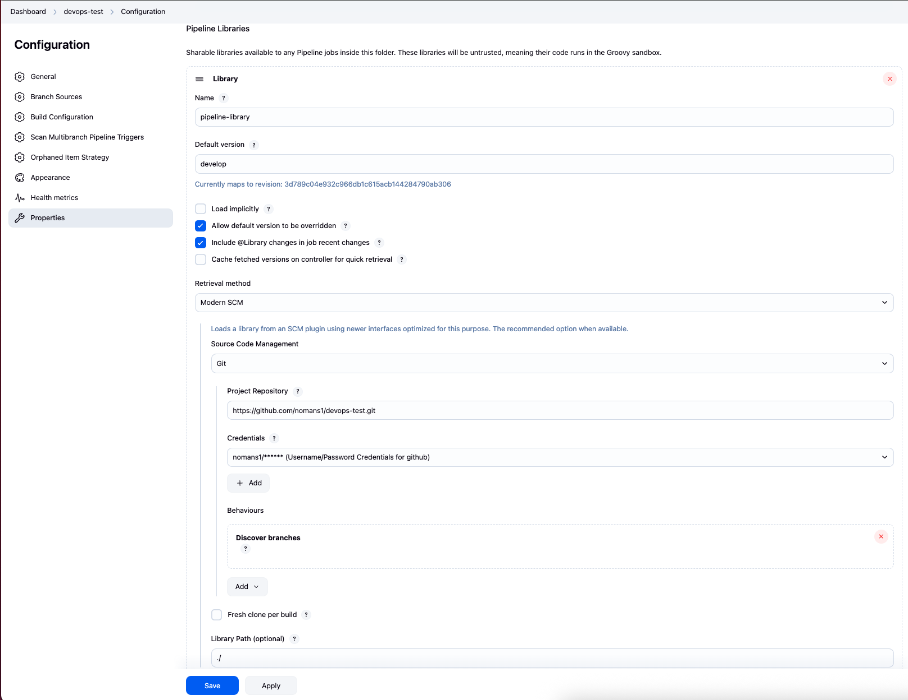

# Jenkins Installation on Minikube using Helm

This guide provides step-by-step instructions to install and configure Jenkins on Minikube using Helm on macOS.

## Overview
**Note:** All of the steps mentioned below are executed by running the `deploy.sh` script attached.
**Note:** Before running the `deploy.sh` script, update the `jenkins-values.yaml` file with your own DockerHub and GitHub credentials. You can add these credentials through Helm or modify the credentials after Jenkins is up and running.

```bash
scripts/deploy.sh
```

This script checks for prerequisites, installs necessary tools, starts Minikube, creates namespaces, adds the Jenkins Helm repository, installs Jenkins, and sets up port forwarding to access Jenkins.

## Prerequisites

- Homebrew
- kubectl
- Minikube
- Helm

1. **Install Required Tools**  
   It installs `kubectl`, `minikube`, and `helm` using Homebrew if they are not already installed.

2. **Start Minikube**  
   Minikube is started using the Docker driver.

3. **Create Kubernetes Namespaces**  
   Namespaces `jenkins` and `applications` are created if they do not already exist.

4. **Add Jenkins Helm Repository**  
   The Jenkins Helm chart repository is added and updated.

5. **Create Cluster Role Binding**  
   A permissive cluster role binding is created to allow Jenkins to function properly.

6. **Install Jenkins**  
   Jenkins is installed using Helm with a custom `jenkins-values.yaml` file.

7. **Wait for Jenkins to be Ready**  
   The script waits for the Jenkins StatefulSet to be ready.

## Accessing Jenkins

- Port forwarding is set up to access Jenkins at http://localhost:8080.
- Press `Ctrl+C` to stop port forwarding.
- Username & Password have been set in the `jenkins-values.yaml` as `admin` & `admin123` respectively.

## Adding Pipeline Libraries

To add pipeline libraries in Jenkins:

1. Go to the Jenkins homepage.

2. Navigate to the 'devops-test' pipeline.
3. Click 'Configure' on the left navbar.

4. Scroll down to 'Pipeline Libraries' and fill in the required details.


## Todos
- Improve ClusterRoleBinding
- Shared Libraries casc needs to be fixed so we don't need to manually add it through the GUI
    - Make shared libraries more modular
- Availability through Ingress
- Deploying on AWS
- Secret Management through Vault, AWS Secrets Manager etc insteading of harcoding secrets in the jenkins-values.yaml
- Configure Jenkins to pick up agents from scripts/agents folder to allow users to define their own agents

